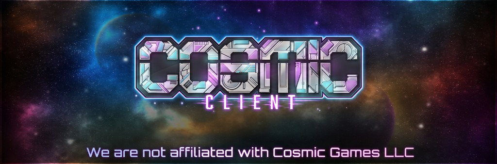
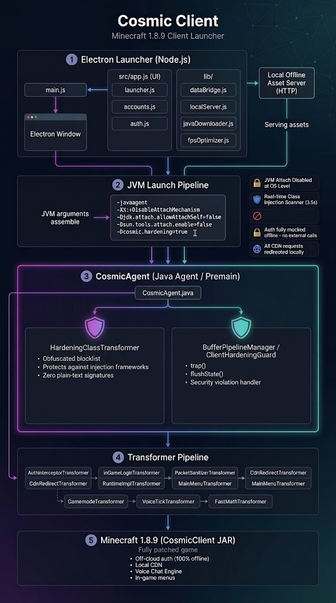

<p align="center">
  
</p>

<p align="center">
  <a href="https://github.com/Open-Sourced-Cosmic-Client/Cosmic-Client-Offcloud/blob/main/LICENSE"></a>
  <a href="#"></a>
  <a href="#"></a>
  <a href="#"></a>
  <a href="#"></a>
</p>

---

## 🌌 About the Project

**Cosmic Client Offcloud** is an open-source project designed to continue the **perpetual usage of Cosmic Client 1.8.9**. 

Natively, it is engineered to prevent the ability to be remotely updated, which is visibly demonstrated through the architectural structure and bytecode isolation of the client. By decoupling network dependencies, providing an embedded offline asset bridge, and intercepting remote CDN updates, the client remains permanently functional, resilient, and fully open-source.

> **Platform Compatibility Note:**  
> The client is currently available for **Windows x64** and **Windows x32**.  
> MacBook support (macOS Apple Silicon & Intel) will be enabled in the perpetual future.

---

## 🏛️ System Architecture

The client operates on a 5-layer decoupled pipeline ensuring zero dependency on remote servers and full client sovereignty:

<p align="center">
  
</p>

### 1. Electron Launcher (Node.js)
- **Frontend / UI (`src/app.js`, `src/styles.css`)**: Dark-mode cyberpunk interface with orbital animations, RAM allocation slider, and local offline account management.
- **Backend Bridges (`lib/`)**:
  - `launcher.js`: JVM argument builder, native library path resolver, and process manager.
  - `localServer.js`: Local HTTP offline asset server routing asset and skin requests locally without external HTTP calls.
  - `accounts.js` & `auth.js`: Offline credential manager and Microsoft authentication bridge.
  - `fpsOptimizer.js`: High-performance garbage collector and JVM tuning presets.

### 2. JVM Launch Pipeline
- Assembles hardened JVM arguments:
  - `-javaagent:cosmic-agent.jar` (bytecode injection engine).
  - `-XX:+DisableAttachMechanism` (prevents external runtime attachment).
  - `-Djdk.attach.allowAttachSelf=false` & `-Dsun.tools.attach.enable=false`.
  - `-Dcosmic.hardening=true` & `-Dcosmic.offline=true`.
  - Selective `--add-opens` flags for Java 9+ modular runtime compatibility.

### 3. CosmicAgent (Java Agent / Premain)
- **`CosmicAgent.java`**: Hooks JVM class loading prior to `main()` execution.

### 4. Bytecode Transformer Pipeline
Modular ASM transformers modifying runtime behavior in memory:
- **`AuthInterceptorTransformer` & `InGameLoginTransformer`**: Mock authentication responses, enabling offline multiplayer and local skin rendering.
- **`CdnRedirectTransformer`**: Reroutes asset and cape lookups to the local internal server.
- **`PacketSanitizerTransformer`**: Cleans packet streams against malicious payloads.
- **`RuntimeImplTransformer`**: Conceals `-javaagent` parameters from runtime reflection checks.
- **`MainMenuTransformer` & `ShiftMenuTransformer`**: Fixes GUI positioning and suppresses dead server banners.
- **`VoiceTickTransformer` & `VoiceModuleHelper`**: Stabilizes voice chat routines when offcloud.
- **`FastMathTransformer`**: Replaces trigonometric calls with lookup tables for enhanced frame rates.

### 5. Minecraft 1.8.9 (CosmicClient JAR)
- Fully patched and optimized client runtime.
- 100% off-cloud authentication, local asset serving, in-game mod menus, and voice chat engine.

---

## 🚀 Quick Launch (Windows)

### Option 1: Standalone All-In-One Launcher (Zero Setup)
Download and run:
```
Cosmic Client Offcloud-1.0 Launcher.exe
```
- **Self-Contained**: Contains the 1.8.9 client JAR, bytecode agent, bundled Zulu OpenJDK 19, native DLLs, sound effects, textures, and configs embedded into a single `.exe`.
- **Zero Requirements**: Runs even on clean Windows systems with no pre-existing Java or Minecraft installations.
- **Portable or System**: Extracts portably next to itself if unpacked, or sets up seamlessly in `%APPDATA%\.minecraft\cosmic`.

### Option 2: 1-Click Interactive Menu
Double-click:
```
START-HERE-WINDOWS.bat
```
Prompts for instant direct launch, GUI desktop launcher, or auto-boots in 5 seconds.

### Option 3: Instant Fast Direct Launch
Double-click:
```
CosmicClient-Direct.exe
```
or run `Launch-Cosmic-Direct.bat` to launch the game directly with maximum FPS optimization in under 2 seconds.

### Option 4: Electron Desktop GUI Launcher
```bash
npm install
npm start
```
or double-click `Launch-GUI.bat`.

---

## 🛡️ Privacy & Zero-Bloat Guarantee

To ensure total user privacy for open-source distribution:
- **No Personal Credentials**: Initialized with standard offline profile (`CosmicPlayer`).
- **No Saved Servers**: `servers.dat` is completely stripped.
- **No Saved Worlds or Radar Maps**: Singleplayer worlds and map caches removed.
- **No Personal Screenshots or Schematics**: Replaced with clean empty folders.
- **No Skin Caches**: Cached multiplayer skins removed.
- **No Dead Bloat**: Removed discontinued 2015 Twitch streaming DLLs and redundant audio files.

---

## 📁 Repository Structure

```
├── Cosmic Client Offcloud Release 1.0/   # Complete ready-to-run release distribution
│   ├── Cosmic Client Offcloud-1.0 Launcher.exe # Standalone single-file launcher
│   ├── CosmicClient-Direct.exe           # Instant 1-click game launcher
│   ├── CosmicClient-x64/                 # Unpacked clean offline vault
│   └── START-HERE-WINDOWS.bat            # Universal starter script
├── cosmic-agent-src/                     # Pure Java Agent Source Code (83 classes)
│   ├── src/main/java/com/cosmic/launcher/# ASM transformers, security guards, auth helpers
│   ├── libs/                             # Bundled dependencies (jna-5.13.0.jar)
│   ├── build.js                          # Universal Java 8 bytecode compiler
│   └── pom.xml                           # Maven project descriptor
├── reverse-engineering/                  # Reverse engineering tools & inspection scripts
│   ├── inspect-classes.js                # Bytecode scanner
│   ├── extract-resources.js              # Resource unpacker
│   └── download-all-offline.js           # Offline sync tooling
├── src/                                  # Electron launcher frontend UI
├── lib/                                  # Electron launcher backend services
├── docs/                                 # Documentation assets (banner, architecture diagram)
├── main.js                               # Electron main process
├── preload.js                            # Secure context bridge
├── package.json                          # Node project manifest & build commands
└── LICENSE                               # MIT Open Source License
```

---

## 🛠️ Building From Source

### Recompiling the Java Agent
```bash
node cosmic-agent-src/build.js
```

### Compiling the Standalone Executable
```powershell
powershell -ExecutionPolicy Bypass -File scripts/build-standalone-exe.ps1
```

### Packaging Release 1.0
```bash
npm run package:release
```

---

## ⚖️ Legal Disclaimer

Cosmic Client Offcloud is an independent open-source preservation project.  
**We are not affiliated, associated, authorized, endorsed by, or in any way officially connected with Cosmic Games LLC or any of its subsidiaries or affiliates.** All product and company names are trademarks™ or registered® trademarks of their respective holders.

---

## 📄 License

Distributed under the [MIT License](LICENSE).
